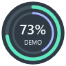
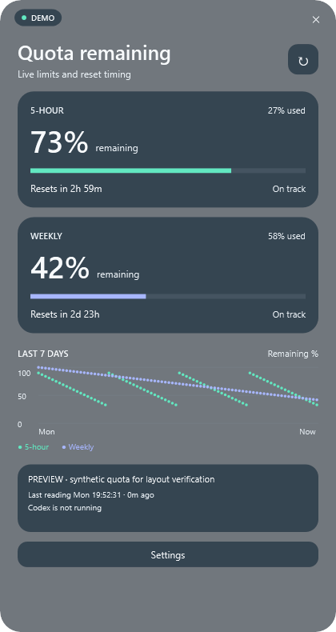

# Codex Usage Tracker

A small, native Windows companion for keeping an eye on your remaining Codex quota. Built with **C# · .NET 8 · WPF** for **Windows 10/11 x64**.

The floating circle stays above other windows while Codex is running. Click it for the detailed panel; drag it to move. The outer teal ring shows five-hour quota remaining, the inner purple ring shows weekly quota remaining, and the center shows the five-hour percentage. The circle shows only the percentage and rings, without a status caption. The rounded, neutral tray menu remains available when the circle is hidden.




Screenshots use clearly marked synthetic preview values, not account data.

## Features

- Always-on-top circular widget with a clean circular edge and no clipped shadow; click or keyboard-activate to open details. Hold and drag anywhere on the circle to move it; the position is saved on release. Dragging never opens the details panel.
- Borderless translucent panels with 40% desktop visibility, rounded glass cards, and light/dark palettes. A single 26-DIP clip keeps the background and content corners aligned; text and controls retain their own opacity.
- Theme-aware system tray menu with aligned quota values, refresh, visibility toggle, settings, and quit; a clear status ring replaces the miniature double-ring icon.
- By default the circle is visible only while a Codex process runs; tray-only and always-visible modes are configurable.
- Five-hour and weekly **remaining** quota, used percentages, and reset countdowns.
- Pace estimate comparing quota consumed with elapsed time in each reported window.
- Local SQLite history, retained for **seven days**; chart leaves gaps across missing readings and resets.
- Configurable warning and critical alerts, defaulting to **25%** and **10%** remaining. Rings and bars turn amber/red; exhausted quota keeps a full red outline at 0%. Persistent panel warnings remain visible even if Windows suppresses notifications.
- Light, dark, and system appearance; remembered widget position. Settings replaces usage in the same frame with Back navigation. The panel chooses an available side of the circle and follows it when dragged; no widget hover tooltip.
- Explicit LIVE, LOCAL, STALE, RESET DUE, and N/A states, plus last-reading timestamp and source details.
- No API key, browser cookies, tracker telemetry, or prompt/response storage.

## Run

Extract the Windows portable package and open **CodexUsageTracker.exe**. The self-contained package includes the .NET runtime and does not require administrator access. Keep its companion files together.

Sign in to Codex normally. The tracker uses Codex's existing sign-in through its app-server; it never reads or copies the credential files itself. If automatic executable discovery fails, select `codex.exe` in **Settings**.

Click the tray icon or the floating circle to open the panel. Escape returns from Settings to usage; otherwise Escape or the panel's close button collapses it. Use **Quit** in the tray menu to exit the app. The circle uses a fixed 96-DIP footprint and follows Windows DPI scaling. Windows may initially place the tray icon in its overflow area.

To start the tracker at Windows sign-in, optionally place a shortcut to the portable executable in the current user's Startup folder (`shell:startup`). Autostart is not enabled automatically.

## Build and test

Install the **.NET 8 SDK** on Windows (8.0.400 or later in the .NET 8 family), then run:

```powershell
dotnet restore CodexUsageTracker.sln
dotnet build CodexUsageTracker.sln -c Release --no-restore
dotnet test CodexUsageTracker.sln -c Release --no-build
dotnet run --project src/CodexUsageTracker.App -c Release
```

Create a portable x64 build:

```powershell
dotnet publish src/CodexUsageTracker.App -c Release -r win-x64 --self-contained true -o artifacts/win-x64
```

The GitHub Actions workflow builds, tests, and uploads a portable Windows artifact. `.gitignore` excludes build outputs, local settings, databases, logs, and environment files.

Optional explicit live integration probe (prints quota fields only):

```powershell
dotnet run --project tools/CodexUsageTracker.Probe -- "C:\path\to\codex.exe"
```

Optional isolated UI render check (synthetic data; no quota request):

```powershell
dotnet run --project src/CodexUsageTracker.App -- --render-preview "C:\temp\tracker-preview" Dark
```

Use `Light` for the second theme. The preview creates isolated temporary settings/history beside its images. Close a running tracker first because the app is single-instance.

## Data sources and privacy

1. **Codex app-server.** A short-lived `codex app-server --listen stdio://` child performs the `initialize` / `initialized` handshake and calls only `account/rateLimits/read`. The tracker explicitly disables analytics and OpenTelemetry exporters on this child. It does not create threads, run prompts, reset credits, or modify account settings. The child is terminated after the read or a 20-second timeout.
2. **Local Codex fallback.** If app-server data is unavailable, inspect the final 1 MiB of up to 24 recent session JSONL files under `$CODEX_HOME/sessions` or `~/.codex/sessions`. Only `event_msg` / `token_count` records with `rate_limits` are converted into quota measurements. Existing session files contain other content; the tracker transiently scans lines but does not retain, log, display, or copy prompt/response content. Their format is not a stable public API.
3. **N/A.** If neither source yields a supported quota window, display N/A. Never infer a quota percentage from tokens or assume that missing data means zero usage.

The multi-bucket response's `codex` entry takes precedence. Other model-specific buckets are not substituted. Durations must explicitly match 300 or 10,080 minutes; unsupported or missing durations remain N/A. Missing reset times remain unknown. A past reset becomes “Reset due · awaiting update,” not an assumed quota refill.

Quota refresh runs every 60 seconds while Codex runs; the countdown updates every second. A known reset triggers an immediate refresh, with a 15-second retry followed by 60-second retries if the source still reports the expired window. Pending resets survive unavailable or partial readings until a later reset is reported for that quota window; abandoned retries expire after eight days. Reads never overlap and an expired reading never implies a refill. Manual refresh works from the tray or panel. Data older than three minutes is STALE. Local fallback is always labelled cached/local. Low-quota alerts only use fresh app-server readings and are deduplicated per threshold and reset window during the running session. Restarting the tracker can repeat a still-applicable warning. Windows notification settings may suppress tray balloons.

The pace estimate extrapolates the window-average usage rate. “Above sustainable pace” means projected consumption exceeds 105% of the quota by reset, allowing a small tolerance. It is unavailable for stale, expired, or unknown-reset data and says “Learning pace” during the first five minutes. It is advisory; it cannot predict future work.

Local files live in `%LOCALAPPDATA%\CodexUsageTracker`:

| File | Contents |
| --- | --- |
| `settings.json` | UI preferences, thresholds, widget location, optional Codex executable path |
| `usage.db` (+ SQLite WAL files) | Observation time, source label, used percentages, reset timestamps |

No identity, prompt text, response text, tokens, cookies, or keys are stored by the tracker. Seven-day retention is applied at startup and refresh; if the app is closed, expired records are removed the next time it runs. **Clear local history** removes all readings. The database uses the normal Windows user profile permissions; it is not separately encrypted. History follows this local profile, so clear it when switching Codex accounts if you want separate charts.

The tracker has no direct HTTP client or telemetry endpoint. Codex itself contacts its services to retrieve quota; that connection is necessary for live readings.

## Project structure

```text
src/CodexUsageTracker.Core/   Quota parsing, source adapters, pacing, alerts, SQLite, settings
src/CodexUsageTracker.App/    WPF windows, tray integration, theme, polling lifecycle
tests/CodexUsageTracker.Tests/  Parsing, fallback, retention, alerts, settings tests
tools/CodexUsageTracker.Probe/  Explicit live app-server integration check
.github/workflows/build.yml  Windows build, tests, portable artifact
docs/                       Architecture and synthetic UI previews
```

## Validation and limitations

The implementation was compiled and tested on Windows 11 x64 with .NET SDK 8.0.425. Fifty automated tests cover bucket selection, unknown/malformed fields, stale readings, countdown boundaries, alert deduplication, local fallback, SQLite retention, settings recovery, click/drag handling at different display scales, quota status thresholds, non-overlapping panel placement, reset refresh retries through unavailable readings, monitor-gap recovery, and queued history operations under a SQLite write lock. Live app-server retrieval was verified with an existing Codex sign-in. Both themes and the settings panel are rendered for visual checks; widget pixels outside the circular edge are verified transparent. Windows 10 compatibility is targeted but has not been tested on a separate Windows 10 machine.

Codex process detection recognizes `codex.exe` (desktop app-server or CLI). The tracker's own temporary quota child is excluded from visibility decisions while it is reading. A background Codex process counts as running even if its main window is closed. There is no taskbar injection, browser scraping, automatic update service, or usage prediction based on token pricing. This is an independent utility, not an official OpenAI product.

Protocol reference: [Official Codex app-server documentation](https://developers.openai.com/codex/app-server).
