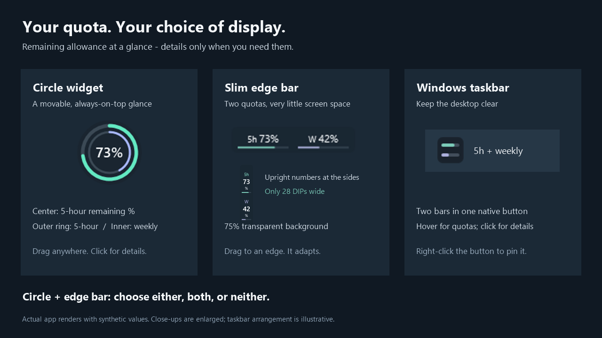
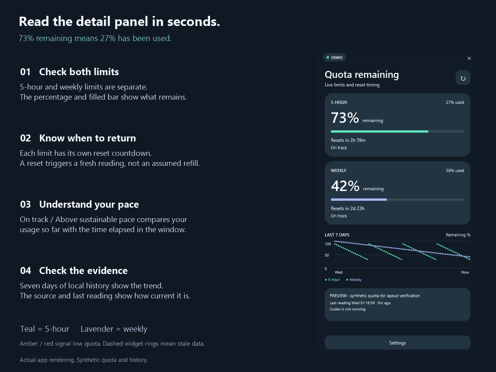

# Codex Usage Tracker

**Know what is left before you hit a limit.** A lightweight Windows companion that shows your remaining Codex quota, reset times, and recent usage.

Windows 10/11 x64 · C# / .NET 8 / WPF · Local history · No API key

[Get started](#get-started) · [Choose your display](#choose-your-display) · [Read the numbers](#read-the-numbers) · [Privacy](#privacy) · [Build from source](docs/DEVELOPMENT.md)

## Choose your display

Use **Circle widget**, **Slim edge bar**, or both. Prefer a clear desktop? Leave both off and use the taskbar. The two desktop displays have equal controls in **Settings** and the tray menu.

| Display | What you see | How you use it |
| --- | --- | --- |
| **Circle widget** | Five-hour percentage, with an outer five-hour ring and inner weekly ring | Drag to move; click for details |
| **Slim edge bar** | Both remaining percentages, with teal and lavender bars | Drag near the top, left, or right edge; release to snap and adapt |
| **Windows taskbar** | A native button with two compact quota bars; warning highlights when low | Hover for both quotas; click for details; right-click to pin |
| **System tray** | A circular status icon and quick-action menu | Open details, refresh, change displays, or quit |

**Fresh-install defaults:** taskbar status on; circle and edge bar off. Existing preferences are preserved. By default, displays appear only while Codex is running; the tray remains available.

The edge bar is **28 DIPs thick** in either orientation, with upright numbers on the sides and a **75%-transparent background**. Windows scales it with your display settings. It overlays a small part of the desktop rather than reserving screen space.

> **Taskbar ≠ system tray.** The taskbar button is separate from the icon beside the clock. Windows controls taskbar grouping and title visibility. Choose **Pin to taskbar** yourself to keep its launcher after the app closes; the tracker does not change your taskbar settings.

## Get started

1. **Get a portable build.** Open [Windows build in GitHub Actions](https://github.com/yx-le/Codex-Usage-Tracker/actions/workflows/build.yml), choose a successful run, and download its **CodexUsageTracker-win-x64** artifact. GitHub may require sign-in. Alternatively, [build from source](docs/DEVELOPMENT.md).
2. **Extract the whole ZIP** to a permanent folder, then open **CodexUsageTracker.exe**. Keep its companion files together. The package includes the .NET runtime; no administrator access is needed.
3. **Open Codex and sign in normally.** Click the tracker’s taskbar button or tray icon, then open **Settings** to choose your displays.
4. **Optional: enable “Automatically launch with Codex.”** A quiet watcher starts at Windows sign-in and launches the tracker when Codex opens. Preferences save automatically; **Done** closes Settings. Invalid values show an error instead of replacing saved preferences.

If the tray icon is hidden, open Windows’ overflow menu beside the clock. If the tracker cannot find Codex, select the existing **codex.exe** in Settings.

## Read the numbers

**Percentages show quota remaining, not quota consumed.** For example, **73% remaining means 27% used**. Five-hour and weekly quotas are separate; each has its own reset time.

| Signal | Meaning |
| --- | --- |
| **Teal / lavender** | Five-hour / weekly quota |
| **Amber** | Low quota: 25% or less remaining by default |
| **Red** | Critical quota: 10% or less remaining by default; 0% is exhausted |
| **Dashed circle rings** | The reading is stale, not a fresh quota measurement |
| **LIVE / LOCAL** | Current app-server reading / cached local fallback |
| **STALE / RESET DUE / N/A** | Old reading / awaiting reset confirmation / no supported reading available |

Warning thresholds are configurable. At 0%, a red outline or track keeps the warning visible even though no allowance remains. The exact percentage is the value to read.

The panel also shows a **pace estimate**, **seven days of local history**, and the **source and last-update time**. Pace is an estimate based on elapsed time and usage so far, not a prediction of future work.

## Everyday behavior

- **Refresh:** readings update about every 60 seconds while Codex runs. A due reset triggers a fresh request, with retries if needed. Manual refresh is available in the panel and tray menu.
- **Open and close:** click a display for details. Escape returns from Settings to usage, then hides the panel. Settings replaces the usage page within the same frame.
- **Automatic startup:** the watcher checks for Codex every two seconds. Choosing **Quit** stops the tracker for that Codex session; after Codex fully exits and starts again, the watcher launches it again. Disable automatic launch in Settings to stop the watcher.
- **Move the portable folder:** toggle automatic launch off before moving it, then on again from the new location.
- **Appearance:** choose Light, Dark, or System. Display positions and preferences are remembered.

## See it in context

Circle widget beside a workspace

Detailed panel over a workspace

Illustrations use actual app renders with synthetic values. Desktop scenes and taskbar arrangements are illustrative; close-ups may be enlarged. No private windows or account data are shown.

## Privacy

**No browser cookies, API key, tracker telemetry, or prompt/response storage.** Source priority is **Codex app-server → local Codex fallback → N/A**. Missing data is never treated as zero usage or a confirmed refill.

Quota readings and preferences stay in `%LOCALAPPDATA%\CodexUsageTracker`. History is retained for seven days and can be cleared in Settings. The fallback scans existing local session records to find quota fields; it does not retain their conversation content. Codex itself contacts its services for live readings.

[Data handling, retention, and source details](docs/DATA-AND-PRIVACY.md)

## Development and limitations

The app has **79 automated tests** and has been built and checked on Windows 11 x64. Windows 10 is targeted but has not been tested on a separate machine. Multi-monitor placement has automated layout coverage; physical multi-monitor testing remains limited.

A background `codex.exe` counts as running, even if its window is closed. Windows may suppress notification balloons. History follows the local Windows profile, so clear it when switching Codex accounts if you want separate charts. There is no automatic updater or taskbar injection.

[Build, test, and preview](docs/DEVELOPMENT.md) · [Architecture](docs/ARCHITECTURE.md) · [Rebuild README illustrations](docs/render-readme.ps1)

This is an independent utility, not an official OpenAI product.
